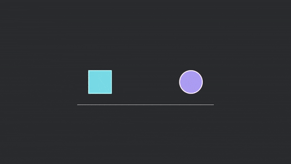

# Bevy MotionGfx

Bevy MotionGfx is a motion graphics creation tool in [Bevy](https://bevyengine.org/). It is highly inspired by [Motion Canvas](https://motioncanvas.io/) & [Manim](https://www.manim.community/).

*Associated example [here](./examples/hello_world.rs)!*

## Goal

The goal of this tool is to procedurally generate animations with code. Below are some of the core design principles used in Bevy MotionGfx:

- Ease of use.
- Performance by default.
- Real-time preview.
- First class support for Bevy ECS.
- 2 way playback support.
- Robust (can be used not just for animation productions, but for all sorts of applications e.g. game development).

## Why this tool?

Procedurally coded animations can be easily scaled to larger projects (e.g. code can be reused/extended/structured).

- **Streamlining timeline editing with code-based animation.** Reorganizing strips and keyframes, particularly when rearranging clips, can be a laborious endeavor. However, with coded animations, the process becomes remarkably efficient. Swapping sections in the timeline is as simple as shifting lines of code up and down, allowing for swift and hassle-free adjustments.

  Here is an image (by [aarthificial](https://youtu.be/WTUafAwrunE)) comparing keyframes and code:
  

- **Seamless version control.** With most of our assets represented as code or serialized values, we seamlessly integrate version control using [Git](https://git-scm.com/)!
- **Unleashing the full power of programming for animation.** In animation, tasks such as handling repetitions, reusing common effects, and more become a breeze by harnessing programming concepts like loops and functions.

### 2 way playback support

In addition to all of the above, Bevy MotionGfx also provides 2 way playback support. This means that the animations you created can be played in both forward and backward directions without any extra computational cost! This is a feature that is very lacking in other code-based animation libraries.

## Easing Functions

Bevy MotionGfx also comes with built-in easing functions which are crucial for animation creation.

*Associated example [here](./examples/easings.rs)!*

## Vector Graphics

In Bevy MotionGfx, all vector graphics are rendered using [Vello](https://github.com/linebender/vello)! This is done using the minimal [Bevy Vello Renderer](https://github.com/nixon-voxell/bevy_vello_renderer).

*Associated example [here](./examples/vello_basic.rs)!*

## Typst Integration

Bevy MotionGfx also supports [Typst](https://typst.app)! It comes with a compiler that compiles Typst content into Svg and display them using [Vello](https://github.com/linebender/vello).

*Associated example [here](./examples/typst_basic.rs)!*

## Join the community!

You can join us on the [Voxell discord server](https://discord.gg/WDBnuNH) or our project focused [VOS (Voxell Open Source) discord server](https://discord.gg/X3ZucbxXFc).

## License

The `bevy_motiongfx` is dual-licensed under either:

- MIT License ([LICENSE-MIT](LICENSE-MIT) or [http://opensource.org/licenses/MIT](http://opensource.org/licenses/MIT))
- Apache License, Version 2.0 ([LICENSE-APACHE](LICENSE-APACHE) or [http://www.apache.org/licenses/LICENSE-2.0](http://www.apache.org/licenses/LICENSE-2.0))

This means you can select the license you prefer!
This dual-licensing approach is the de-facto standard in the Rust ecosystem and there are [very good reasons](https://github.com/bevyengine/bevy/issues/2373) to include both.
